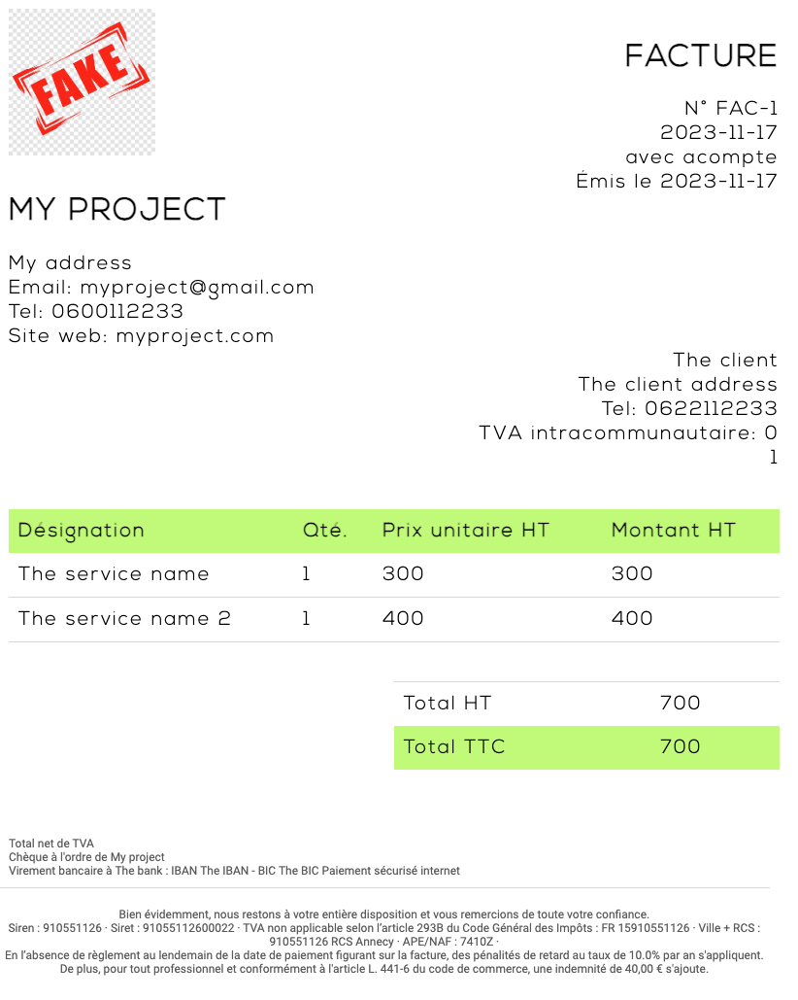

# Rust + Yew web application to generate receipts

Code coverage : Many tests are written but coverage measurement needs to be added (TODO : find how to have coverage with `wasm_bindgen_test`)

## Purpose

The purpose of this project is to provide a Web interface to generate any receipt for your business. The UI can be accessed [here](jackcat13.github.io/receipt-generator/).

It aims to showcase how a graphical interface can be built using the `Yew` framework building wasm application. Deployment process to `Github pages` is automated, meaning any new commit sent to main branch automatically deploys a new version of the web interface (It relies on `trunk serve` command).

## How it works ?

When you access the UI, a form with many fields allows you to enter required details about your receipt (.

Once you submit the form, you obtain a receipt similar to the following screenshot :

You can print the receipt in PDF format to retrieve the receipt locally.

:notebook: To help generate multiple receipts, form information is stored on your local machine only (nothing is sent to any server). That way, anytime you open the form again, each field of the form is prefilled with data used with last submission.

TODO : Localize the generator to work with different languages based on browser chosen profile.